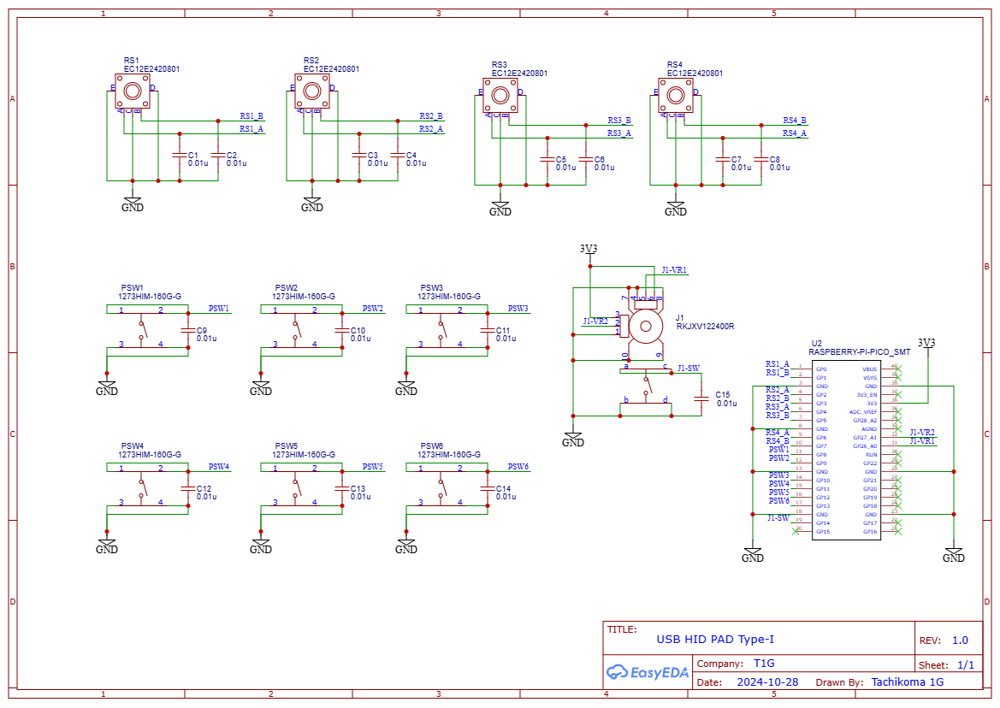

# USB HID Pad

Programmable hardware for create own USB HID pad.

# Basic design

* Use Raspberry Pi Pico that is provide USB Composite Device function(USB HID, USB Mass storage, USB CDC(Serial))
* Use Circuitpython
* Type-I Hardware features
    * 6 Buttons
    * 4 Rotary encorder
    * 1 Joy stick(2-axis with center button)

# Type-I

First model of USB HID Pad.

| Front 3D | Rear 3D |
|---|---|
|   |   |

| Schematics | PCB |
|---|---|
| ||
